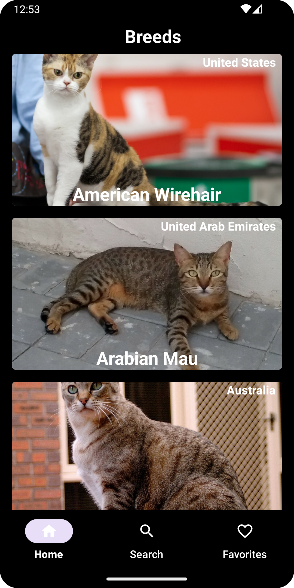
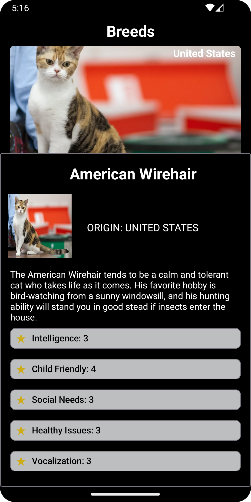

# CatsByme :smile_cat:  :construction:
This project is a Poc based in Cat Api: https://developers.thecatapi.com/, 
was built with Android Studio Dolphin, with clean architecture in a multi-modules structure. 
The core module is the center and other modules branch off from it. The data module wraps remote
and local modules. There's also a common and a domain module inside the core. 
The features module outside of the core uses the domain.

The code is characterized by:

-  :white_check_mark: **Feature Modularization**: The code is organized into modules based on specific features.
-  :white_check_mark: **Clean Architecture**: Some Applications of Clean Architecture principles for separation of concerns and decoupling.
-  :white_check_mark: **MVVM Pattern (Model-View-ViewModel)**: Use of the MVVM UI pattern for separating business logic and user interface.
-  :white_check_mark: **Dependency Injection with Hilt**: Dependency management using Hilt for dependency injection.
-  :white_check_mark: **Kotlin Coroutines**: For asynchronous tasks.
-  :white_check_mark: **Flow and StateFlow**: Use of these components for managing states and asynchronous interactions.

The project also integrates other technologies and libraries, such as `Retrofit` for network calls

---

This project has been developed in Android Studio version:
-  `Flamingo | 2022.2.1 Patch 2`
-  `Build #AI-223.8836.35.2231.10811636`
-  `Java JDK 17`

## Module Dependencies docs

* [Modularization](https://developer.android.com/topic/modularization)

* [Kotlin Coroutines](https://developer.android.com/kotlin/coroutines)

* [Koin dependency injection](https://developer.android.com/training/dependency-injection/hilt-android)

* [Kotlin Coroutines](https://developer.android.com/kotlin/coroutines)

* [MVVM - presentation pattern] 

* [Clean architecture](https://blog.cleancoder.com/uncle-bob/2012/08/13/the-clean-architecture.html)

* [StateFlow for View states](https://developer.android.com/kotlin/flow/stateflow-and-sharedflow#stateflow)

* [DiffUtil](https://developer.android.com/reference/androidx/recyclerview/widget/DiffUtil)

* [ViewBinding](https://developer.android.com/topic/libraries/view-binding)

* [Lifecycle](https://developer.android.com/guide/components/activities/activity-lifecycle)

* [Mockk](https://mockk.io/ANDROID.html)

## Screens

  

## Manager Project and Architecture
 * [Trello](https://trello.com/b/rLvtzPrn/katsbyme)

